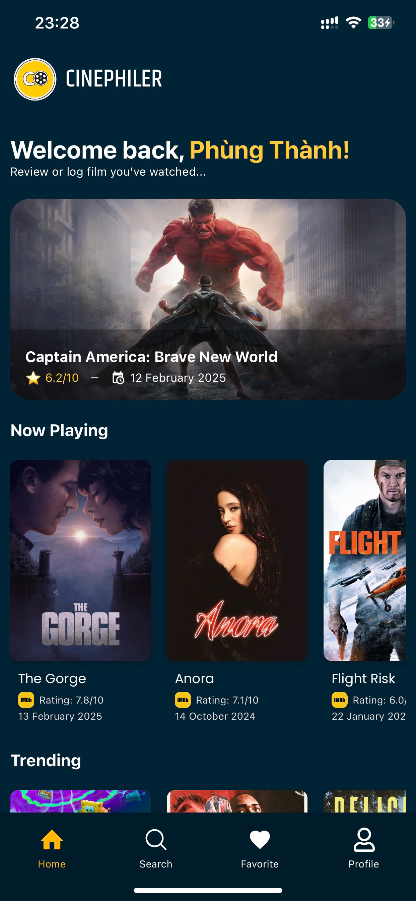
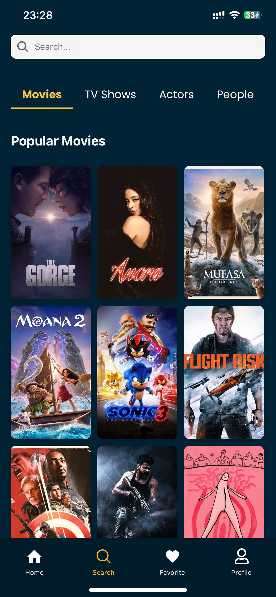
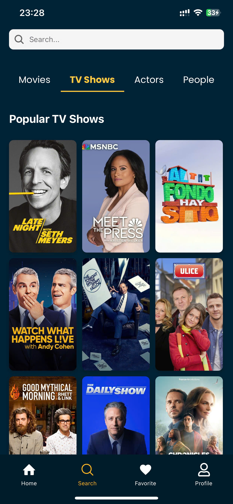
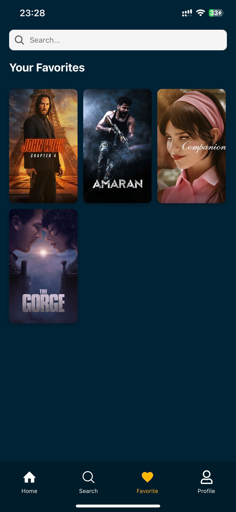
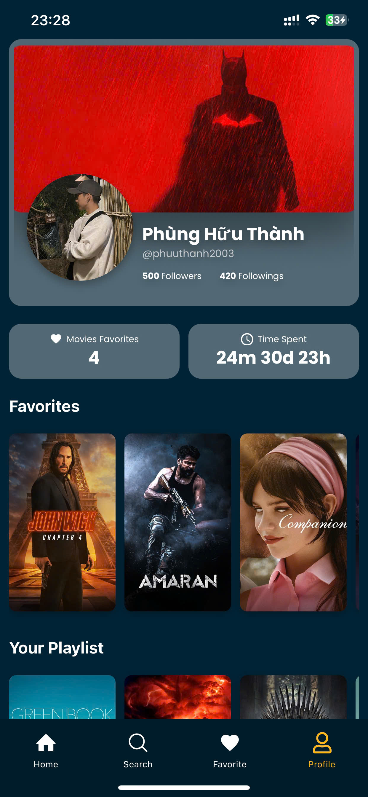
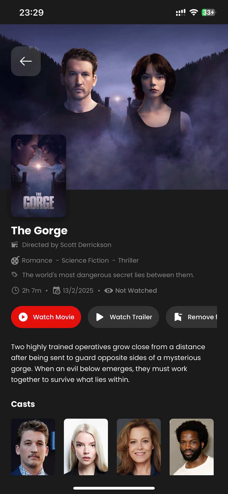
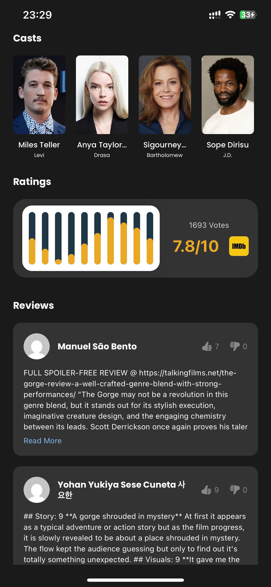
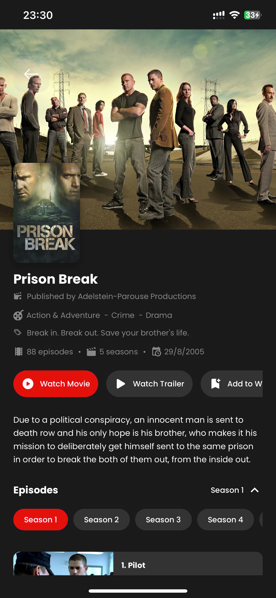
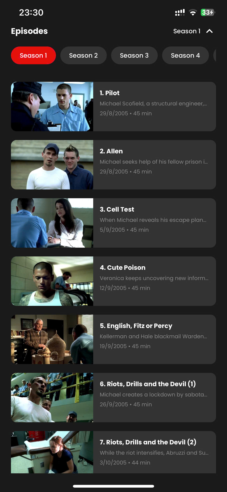
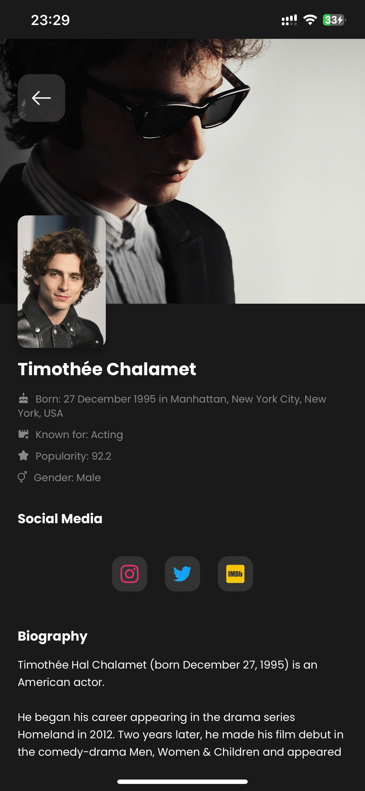

# Movie App

A React Native mobile application for browsing and discovering movies. This app provides users with a seamless experience to explore movies, view details, and manage their watchlist.

## Features

- Browse popular and trending movies
- View detailed movie information
- Search for specific movies
- Bottom tab navigation for easy access
- Responsive and modern UI design
- Integration with movie database API
- Chart visualization
- Carousel display for movie lists

## Screenshots

Here are some screenshots of the application:

<div style="display: flex; justify-content: space-between;">
    
    
    
    
</div>
<div style="display: flex; justify-content: space-between;">
    
    
    
    
</div>

<div style="display: flex; justify-content: space-between;">
    
    
    
    
</div>

## Technologies Used

- React Native
- Expo
- React Navigation
- Axios for API calls
- AsyncStorage for local storage
- React Native Chart Kit
- React Native Snap Carousel
- And various other supporting libraries

## Setup Instructions

1. Clone the repository
2. Install dependencies:
   ```bash
   npm install
   ```
3. Create a `.env` file based on `.env.example` and add your configuration
4. Start the development server:
   ```bash
   npm start
   ```
5. Use Expo Go app on your mobile device or an emulator to run the application

## Scripts

- `npm start`: Start the Expo development server
- `npm run android`: Run on Android emulator/device
- `npm run ios`: Run on iOS simulator/device
- `npm run web`: Run in web browser

## Dependencies

Main dependencies include:
- @react-native-async-storage/async-storage
- @react-navigation/bottom-tabs
- @react-navigation/native
- @react-navigation/native-stack
- axios
- expo
- react-native-chart-kit
- react-native-snap-carousel
- And more (see package.json for complete list)

## Development Dependencies

- @babel/core

## Notes

- Make sure you have Expo CLI installed globally
- Ensure all environment variables are properly configured
- The app requires an active internet connection for fetching movie data

## Contributing

Feel free to submit issues and enhancement requests.

## License

This project is private and proprietary. 